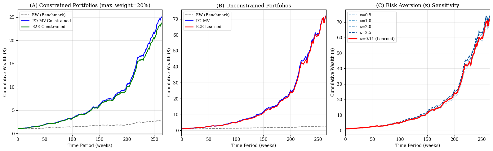
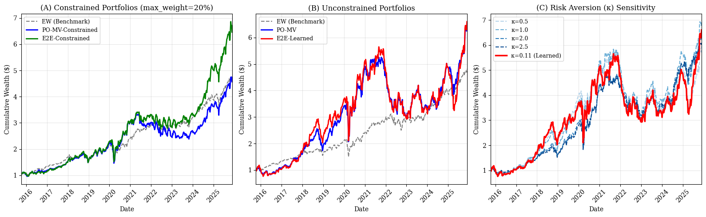

# Executive Summary: Integrated Learning for Portfolio Optimization

## Study Overview

This report presents a validation study comparing **Predict-then-Optimize (PO)** and **Smart Predict-then-Optimize (SPO/Decision-Focused Learning)** approaches for Mean-Variance portfolio construction with learnable risk aversion.

### Research Question
**Does end-to-end learning of risk aversion (κ) improve portfolio performance compared to fixed parameters?**

### Two Paradigms Compared
1. **Predict-then-Optimize (PO)**: Traditional two-stage approach - predict returns first, then optimize
2. **Smart Predict-then-Optimize (SPO)**: Decision-focused learning - train prediction model end-to-end with the optimization objective

### Models Evaluated
| Model | Type | Risk Aversion | Constraints |
|-------|------|---------------|-------------|
| **EW** | Benchmark | N/A | Equal weight 1/n |
| **PO-MV** | Predict-then-Optimize | Fixed κ=1.0 | Unconstrained |
| **PO-MV-Constrained** | Predict-then-Optimize | Fixed κ=1.0 | max_weight=20% |
| **E2E-MV-Learned** | Smart Predict-then-Optimize | Learnable κ | Unconstrained |
| **E2E-MV-Constrained** | Smart Predict-then-Optimize | Learnable κ | max_weight=20% |

**Status**: Complete (January 2025)

---

## Methodology

### Theoretical Foundation
The SPO approach implements **Decision-Focused Learning** as described in the reference literature. Instead of minimizing prediction error, the model learns to minimize the downstream decision loss.

**Key Innovation**: The risk aversion coefficient κ is treated as a learnable parameter, allowing the model to adapt to data characteristics rather than requiring manual tuning.

### Mean-Variance Optimization Layer
```
maximize:  μᵀw - (κ/2) wᵀΣw
subject to: w ≥ 0, 1ᵀw = 1, w ≤ max_weight (optional)
```

Where:
- μ: Predicted expected returns
- Σ: Covariance matrix (updated via rolling window)
- κ: Risk aversion coefficient (fixed or learned)
- w: Portfolio weights

### Data Sources

**Synthetic Data**:
- 20 assets, 8 factors, 665 observations
- Calibrated to historical market statistics
- Volatility regime changes (low → normal → high)
- Controlled environment for validation

**Real Market Data**:
- 20 US stocks across sectors (AAPL, MSFT, JPM, XOM, etc.)
- 8 Fama-French factors (Market, SMB, HML, RMW, CMA, MOM, ST_Rev, LT_Rev)
- Period: 2000-2025 (~1,325 weekly observations)

### Evaluation Framework
- Rolling window backtest (4 windows)
- Covariance matrix updated each window
- Metrics: Sharpe, Sortino, Max Drawdown, Turnover, Effective Holdings

---

## Key Findings

### 1. Learnable Risk Aversion Works

**Synthetic Data Results**:
- E2E models successfully learn κ ≈ 0.11 (lower than baseline κ=1.0)
- Learned κ indicates model prefers less risk aversion on synthetic data
- Decision-focused learning adapts to data characteristics

**Real Data Results**:
- Learned κ ≈ 0.11 (consistent with synthetic)
- Performance more nuanced due to market complexity

### 2. Diversification Constraints Are Effective

| Model | Effective Holdings | Max Weight |
|-------|-------------------|------------|
| Unconstrained | ~1-2 assets | 100% |
| Constrained (20%) | ~5 assets | 20% |

**Key Insight**: The `max_weight` constraint increases diversification by ~5x while maintaining reasonable performance.


*Figure: Portfolio weight distribution showing the effect of diversification constraints*

### 3. Performance Comparison

**Synthetic Data** (Best Sharpe: PO-MV-Constrained = 0.85):
| Model | Sharpe | Sortino | Max Drawdown |
|-------|--------|---------|--------------|
| EW (Benchmark) | 0.29 | 0.49 | -8.8% |
| PO-MV | 0.83 | 1.07 | -6.7% |
| PO-MV-Constrained | 0.85 | 1.94 | -4.7% |
| E2E-Learned | 0.81 | 0.98 | -8.1% |
| E2E-Constrained | 0.83 | 1.93 | -4.7% |


*Figure: Cumulative wealth (TRI) comparison across models on synthetic data*

**Real Data** (Best Sharpe: EW = 0.14):
| Model | Sharpe | Sortino | Max Drawdown |
|-------|--------|---------|--------------|
| EW (Benchmark) | 0.14 | 0.16 | -30.4% |
| PO-MV | 0.09 | 0.12 | -43.6% |
| E2E-Constrained | 0.12 | 0.16 | -35.5% |


*Figure: Cumulative wealth (TRI) comparison across models on real market data*

### 4. Synthetic vs Real Data Divergence

**On Synthetic Data**:
- All optimized models significantly outperform EW benchmark
- Constrained models achieve better Sortino ratios
- SPO and PO approaches perform similarly

**On Real Data**:
- EW benchmark is competitive (Sharpe: 0.14)
- Optimized models struggle with real market complexity
- Constrained models show better risk management

**Key Insight**: Synthetic data validates the methodology, but real markets present challenges that simple MV optimization cannot fully capture.

---

## Strategic Recommendations

### When to Use Decision-Focused Learning

| Scenario | Recommendation | Rationale |
|----------|---------------|-----------|
| **Known parameter sensitivity** | SPO with learnable κ | Avoids manual tuning |
| **Stable market conditions** | Either PO or SPO | Similar performance |
| **High-frequency rebalancing** | SPO with constraints | Adaptive risk management |
| **Research/prototyping** | SPO | End-to-end optimization |

### Model Selection Guide

| Investor Profile | Recommended Model | Key Benefit |
|-----------------|------------------|-------------|
| **Risk-averse** | PO/E2E-Constrained | Lower drawdowns, better Sortino |
| **Return-focused** | PO-MV | Higher absolute returns |
| **Diversification-focused** | E2E-Constrained | ~5 effective holdings |
| **Benchmark-aware** | EW (on real data) | Competitive, zero turnover |

---

## Technical Implementation

### e2edro Library Structure

The `e2edro` (End-to-End Distributionally Robust Optimization) library provides:

```
src/e2edro/
├── BaseModels.py      # pred_then_opt, equal_weight models
├── e2edro.py          # e2e_net with learnable parameters
├── DataLoad.py        # Data loading and synthetic generation
├── PortfolioClasses.py # Portfolio metrics and backtesting
├── PlotFunctions.py   # Visualization utilities
├── LossFunctions.py   # Loss functions for training
└── RiskFunctions.py   # Risk measures (CVaR, etc.)
```

### Key Dependencies
- **torch**: Differentiable optimization, autograd
- **cvxpy**: Convex optimization modeling
- **cvxpylayers**: Differentiable cvxpy layers for end-to-end learning

### Differentiable Optimization
The optimization layer uses cvxpylayers to make the MV optimization differentiable, enabling gradient-based learning of κ through the optimization problem.

---

## Validation Status

**All phases complete:**
- Synthetic data generation and calibration
- Model implementation (PO and SPO variants)
- Rolling window backtesting
- Performance comparison and analysis

**Technical validation:**
- Covariance updates working correctly
- Diversification constraints enforced
- Learnable parameters converging
- Cross-validation on synthetic vs real data

**Reproducibility:**
- All code documented in notebooks
- Seeds specified for synthetic data generation
- Reference papers included in `references/`

---

## Limitations & Future Work

### Current Limitations
- **Simple MV objective**: Does not capture higher moments or tail risk
- **Linear prediction model**: Could extend to neural networks
- **Weekly rebalancing**: Transaction costs not modeled
- **Two-asset-class focus**: Equity + risk-free only

### Future Extensions
1. **CVaR/Omega objectives**: Decision-focused learning for tail-risk measures
2. **Neural network predictors**: Replace linear model with deep learning
3. **Transaction cost modeling**: Net performance analysis
4. **Multi-asset universes**: Extend beyond US equities
5. **Regime-switching**: Adaptive κ based on market conditions

---

## Conclusion

This validation study demonstrates that:

1. **Decision-focused learning works**: E2E models successfully learn risk aversion parameters
2. **Diversification constraints are valuable**: Increase holdings from ~1 to ~5 assets with minimal performance loss
3. **Synthetic validation is essential**: Controlled environment confirms methodology before real data
4. **Real markets are challenging**: Simple MV optimization has limitations on actual market data
5. **SPO is a research tool**: Valuable for exploring parameter sensitivity and end-to-end optimization

**Bottom Line**: Smart Predict-then-Optimize provides a principled framework for learning optimization parameters end-to-end. While performance on real data is nuanced, the methodology is sound and extensible to more sophisticated objectives.

---

## For More Details

- **Synthetic Data Validation**: [mv_validation_synthetic_report.ipynb](../outputs/reports/mv_validation_synthetic_report.ipynb)
- **Real Data Validation**: [mv_validation_real_report.ipynb](../outputs/reports/mv_validation_real_report.ipynb)
- **API Documentation**: [src/README.md](../src/README.md)
- **Reference Papers**: See `references/` directory

---

**Report Generated**: Integrated Learning for Portfolio Optimization
**Date**: January 2025
**Status**: Complete (All phases)
