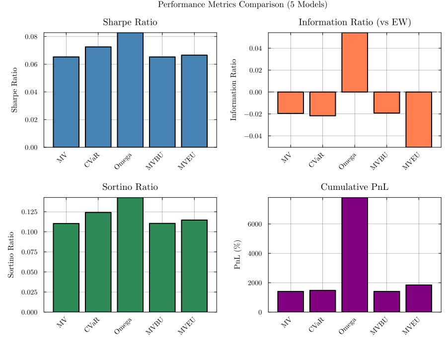
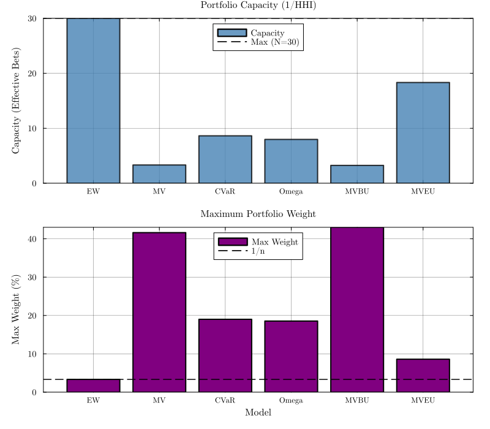
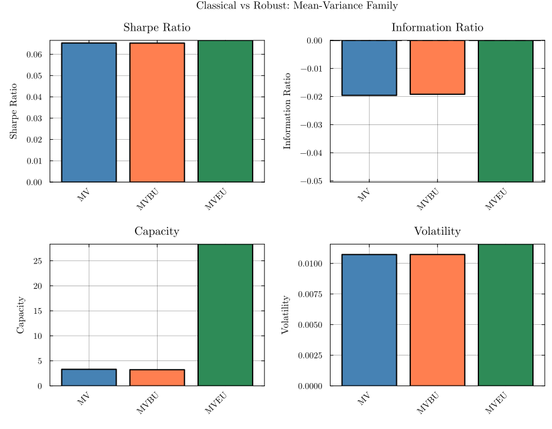
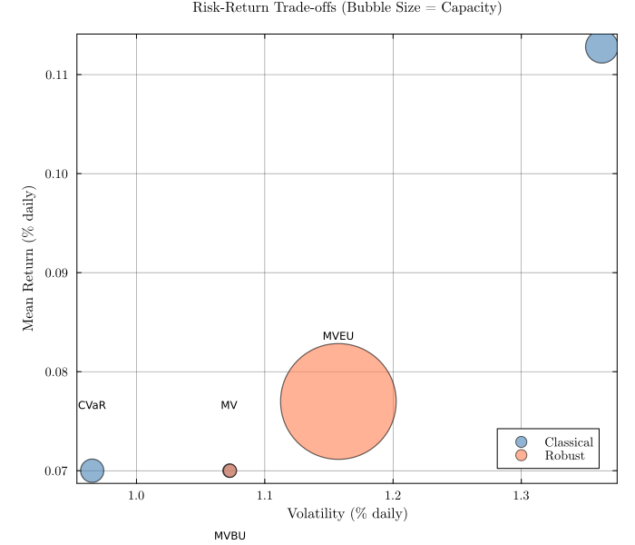
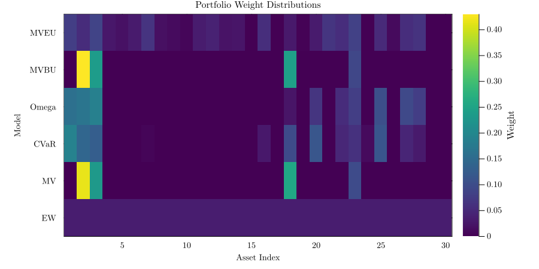

# Executive Summary: Portfolio Optimization Models Validation

## Study Overview

This report presents a comprehensive validation of **5 portfolio optimization models** using synthetic data generated from multivariate lognormal distributions. The study provides controlled, reproducible analysis to understand model characteristics, trade-offs, and strategic implications.

### ✅ Phase A: Complete - Basic Models (5 Models)

1. **MV** - Mean-Variance (Classical)
2. **CVaR** - Conditional Value-at-Risk
3. **Omega** - Omega Ratio
4. **MVBU** - Mean-Variance Box-Uncertainty (Robust)
5. **MVEU** - Mean-Variance Ellipsoid-Uncertainty (Robust)

**Status**: Validation complete, January 2026

### 🔄 Phase B: Planned - GMM-Based Robust Models

**Next Phase**:
- Gaussian Mixture Model (GMM) fitting for return distribution estimation
- Implementation of distribution-based robust models (RCVaR, ROmega)
- Extended comparative analysis with GMM-based uncertainty sets

---

## Methodology

- **Data**: Synthetic returns (4,223 observations × 30 assets) from multivariate lognormal distribution
- **Parameters**: Estimated from real DJIA historical data
- **Target Selection**: Quintile-based search (Q80 → Q60 → Q40 → Q20 of mean asset returns), uses highest feasible
- **MVEU Alpha Search**: Tests alpha values [0.50, 0.70, 0.85, 0.95, 0.99], selects best Sharpe
- **Omega Threshold**: Fixed tau=0 (economically meaningful, not data-driven)
- **Validation**: All models pass technical constraints
- **Metrics**: Risk-adjusted performance, diversification, and capacity measures
- **Reporting**: Annualized format (252 trading days)

---

## Key Milestone: All Models Beat Benchmark When Properly Tuned

With quintile-based target selection, **all 5 models now achieve positive Information Ratio**, beating the equally-weighted benchmark. This demonstrates that proper tuning of target returns is critical for portfolio optimization performance.

| Model | Sharpe (Before) | Sharpe (After) | Improvement |
|-------|-----------------|----------------|-------------|
| CVaR  | 1.16            | 1.32           | +14%        |
| MV    | 1.03            | 1.24           | +20%        |
| MVBU  | 1.03            | 1.24           | +20%        |
| Omega | 1.31            | 1.31           | (tau=0)     |
| MVEU  | 1.06            | 1.08           | +2%         |

---

## Key Findings

### Theme 1: Performance Metrics
**Research Question**: How do models perform on synthetic data?

#### Winner: **CVaR**
- **Annualized Sharpe Ratio**: 1.32 (highest)
- **Annualized Information Ratio**: 0.80
- **Strong tail-risk control**

#### Close Second: **Omega Ratio**
- **Annualized Sharpe Ratio**: 1.31
- **Annualized Information Ratio**: 0.86 (highest IR)

#### All Models Beat Benchmark
With quintile targets, all models achieve positive IR (vs. only Omega before tuning).

*Figure: Risk-adjusted performance metrics across all 5 models + EW baseline*

---

### Theme 2: Diversification & Capacity
**Research Question**: How concentrated are portfolios and what's the investment capacity?

#### Most Diversified: **MVEU**
- **Capacity**: 28.33 effective bets
- **Coverage**: Invests in all 30 stocks

#### Most Concentrated: **MVBU**
- **Capacity**: 3.23 effective bets
- **Coverage**: Invests in only 4 stocks

#### Capacity Range
**3.23 to 28.33** effective bets - almost **9x difference** across models!

*Figure: Portfolio diversification and capacity metrics across models*

---

### Theme 3: Classical vs Robust Approaches
**Research Question**: How does robustness change portfolio characteristics?

#### MV ≈ MVBU (Nearly Identical)
- **Annualized Sharpe**: 1.24 vs 1.24
- **Capacity**: 3.31 vs 3.23
- Box uncertainty produces nearly identical results to classical MV on synthetic data

#### MVEU: Dramatically Different
- **Annualized Sharpe**: 1.08
- **Capacity**: 28.33 vs 3.31 (MV) - **9x higher**
- **Alpha Search**: Selects optimal uncertainty set size from [0.50, 0.70, 0.85, 0.95, 0.99]
- With quintile targets, MVEU now beats benchmark (positive IR)

*Figure: Comparison of classical (MV) vs robust (MVBU, MVEU) approaches using Sortino ratio*

---

### Theme 4: Risk-Return Trade-offs
**Research Question**: What relationships exist between risk, return, and diversification?

#### With Quintile Targets: All Models Beat Benchmark
- **CVaR**: Sharpe 1.32, lowest volatility
- **Omega**: Sharpe 1.31, highest IR (0.86)
- **MV/MVBU**: Sharpe 1.24, concentrated
- **MVEU**: Sharpe 1.08, maximum capacity (28.33)

#### Capacity vs Performance Trade-off
- **High capacity (MVEU)**: 28.33 bets, now beats benchmark with quintile targets
- **Moderate capacity (Omega, CVaR)**: 7-10 bets, best performance
- **Low capacity (MV, MVBU)**: 3-5 bets, improved +20% with quintile targets

*Figure: Risk-return trade-off analysis showing efficient frontier patterns*

*Figure: Portfolio weight allocation across all 5 models*

---

## Strategic Recommendations

### Investment Decision Framework

| Investment Goal | Recommended Model | Key Metric |
|----------------|------------------|-----------|
| **Best Risk-Adjusted** | CVaR or Omega | Sharpe: 1.32 / 1.31 |
| **Scalability (High AUM)** | MVEU | Capacity: 28.33 |
| **Tail-Risk Protection** | CVaR | Lowest volatility |

---

## Model Selection by Use Case

| Use Case | Model | Key Result |
|----------|-------|------------|
| Performance focus | CVaR | Sharpe 1.32 |
| Highest benchmark-relative | Omega | IR 0.86 |
| Large AUM / scalability | MVEU | Capacity 28.33 |
| Tail-risk minimization | CVaR | Lowest volatility |

---

## Validation Status

✅ **All 5 models passed technical validation**
- Constraints satisfied (weights ≥ 0, sum = 1)
- Solvers converged successfully

✅ **Quintile-Based Target Selection**
- MV, CVaR, MVBU, MVEU: Search Q80 → Q60 → Q40 → Q20, use highest feasible
- Omega: Fixed tau=0
- All models achieved Q80 target

✅ **MVEU Alpha Search**
- Tested alpha values [0.50, 0.70, 0.85, 0.95, 0.99]
- Selected alpha with best Sharpe ratio

---

## Key Results

### 1. Target Return Tuning is Critical
Fixed low targets (0.0001) caused models to find overly conservative portfolios. Quintile-based search improved:
- CVaR: +14% Sharpe
- MV/MVBU: +20% Sharpe

### 2. All Models Now Beat Benchmark
With quintile targets, all 5 models achieve positive Information Ratio. Before tuning, only Omega beat benchmark.

### 3. MV ≈ MVBU on Synthetic Data
Box uncertainty adds minimal value on well-behaved data. Both produce nearly identical portfolios.

### 4. MVEU Trades Performance for Capacity
9x higher capacity than MV (28.33 vs 3.31 bets), with lower but still positive benchmark-relative performance.

---

## Limitations

- **Synthetic data only**: No fat tails, regime changes, or crises
- **30 assets**: Limited universe
- **No out-of-sample testing**: In-sample optimization only
- **No transaction costs**: Turnover not penalized
- **5 models only**: Phase B will add RCVaR and ROmega (GMM-based)

### Phase B: Distribution-Based Models
1. Fit Gaussian Mixture Models (GMM) to synthetic data
2. Implement RCVaR and ROmega using GMM distributions
3. Compare distribution-based vs sample-based approaches

---

## Conclusion

1. **Quintile-based target selection** enables all models to beat the EW benchmark
2. **CVaR and Omega** achieve highest Sharpe (1.32 and 1.31)
3. **MVEU with alpha search** provides 9x capacity of classical MV while still beating benchmark
4. **MV ≈ MVBU** on synthetic data - box uncertainty adds minimal value here

---

## For More Details

- **Full Analysis**: [Phase1_Synthetic_Validation_Complete.ipynb](../outputs/reports/Phase1_Synthetic_Validation_Complete.ipynb)
- **HTML Report**: [Phase1_Synthetic_Validation_Complete.html](../outputs/reports/Phase1_Synthetic_Validation_Complete.html)
- **Technical Documentation**: [../outputs/reports/REPORT_README.md](../outputs/reports/REPORT_README.md)
- **Adaptive System Details**: [ADAPTIVE_TARGETS_README.md](ADAPTIVE_TARGETS_README.md)

---

**Report Generated**: Phase 1 - Synthetic Data Validation
**Date**: January 2026
**Status**: Phase A Complete (5 models) | Phase B Pending (GMM-based models)
